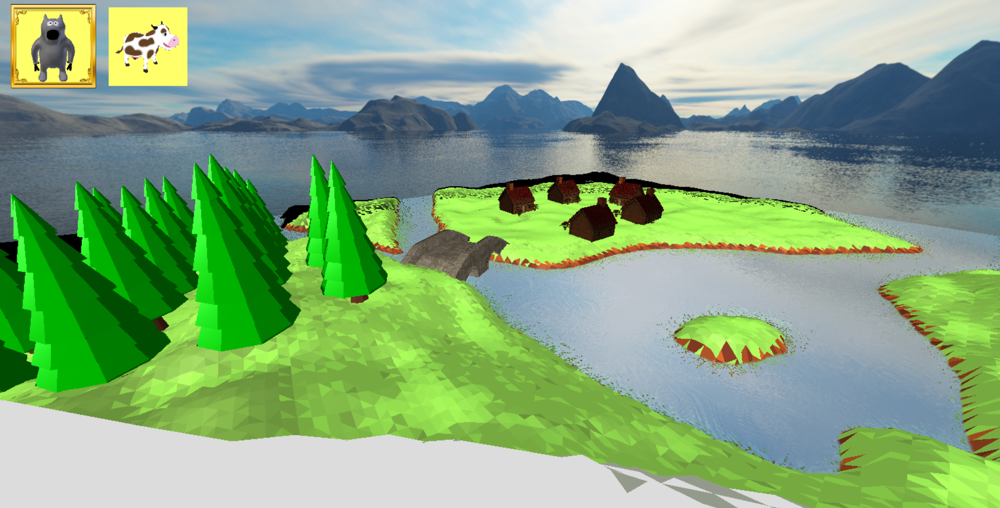
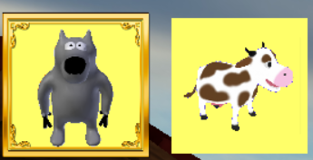
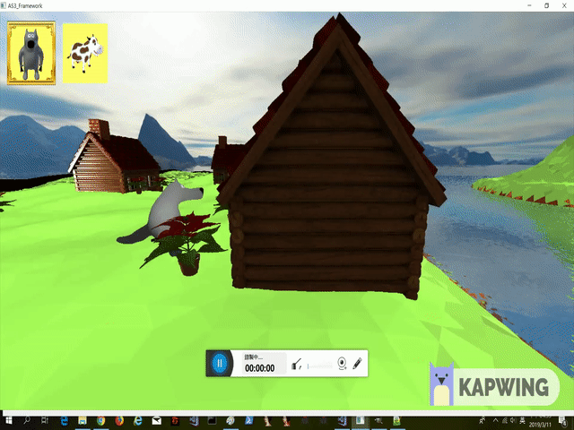
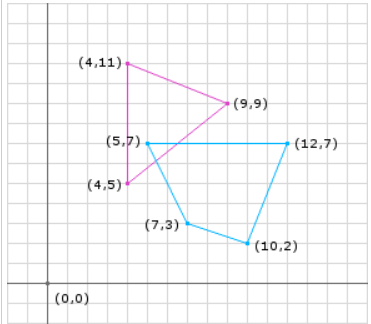
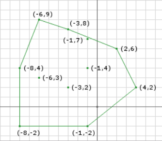

OpenGL(Programmable Pipeline) Project
===================
這個是三人的小組Project

我負責的部分為:collision detection, controller(AI, Keyboard), Animal Manager(fbx loading, creation), Water Simulation

### 1.畫面

UI(Change Animal)

### 2.Implement

1. LandScape(另外一位組員負責)

主要是由三張Map做weight上的blending所組成

* 1. River Map
* 2. Mountain Map
* 3. Floor Map
* 基本上就是Floor Map可以做random，再跟River Map, Mountain Map做blend，這裡並沒有用到geometry, tesellation shader
* 而是把所有點都當成vertex丟進vertex shader

2. collision detection

* 1. Cube : 簡單起見就用最簡單的Cube來做collision primitive
* 2. Algorithm : 我是用GJK algorithm來偵測Cube的重疊

3. Controller(AI, Keyboard)

* Player Controller(base class)
** Member : List of GameObject
** Virtual Function : 
** AddGameObject() : Add GameObject To Controller
** UpdatePosition(float _fDeltaTime) : Update all gameobject position

* Keyboard Controller(inherit PlayerController)
** Update Direction From Keyboard Input

* AI Controller(inherit PlayerController):
** Update Direction From Rules

4. Animal Manager

* 1.Register Animal:
** Preload Fbx mesh
** Setting list of parameters

* 2.Create Animal(EAnimalType):
** Create GameObject base on AnimalType, and return the gameobject

5. MovementSimulator:

* 1. Contain list of playercontroller
* 2. Update All gameobject position

6. Water Simulation:

主要是參考[OpenGL Water Tutorial](https://www.youtube.com/watch?v=HusvGeEDU_U&list=PLRIWtICgwaX23jiqVByUs0bqhnalNTNZh)

* 1. Refraction
* 2. Reflection
* 3. DU/DV
* 3. NormalMap

互動式(GameObject hit the water surface will make a wave effect)

這主要是參考(Unreal Example Project - Render Target)

* 1.用一個height map紀錄water simulation的height，當物體hit water surface的時候在該點的height map上畫上一個點，然後用一個演算法來讓他擴散跟decay。
* 2.用tesselation shader來讓vertex的height根據height map產生變化

7. Click Detector

Detect the global position where user click on screen

 
* 1. Use the new FBO and new fragment shader which output vector4 is the world position of the vertex -> store the screen world position on a texture
* 2. When user click on screen, get the pixel value from FBO's GL_COLOR_ATTACHMENT0 according to the click position x,y

